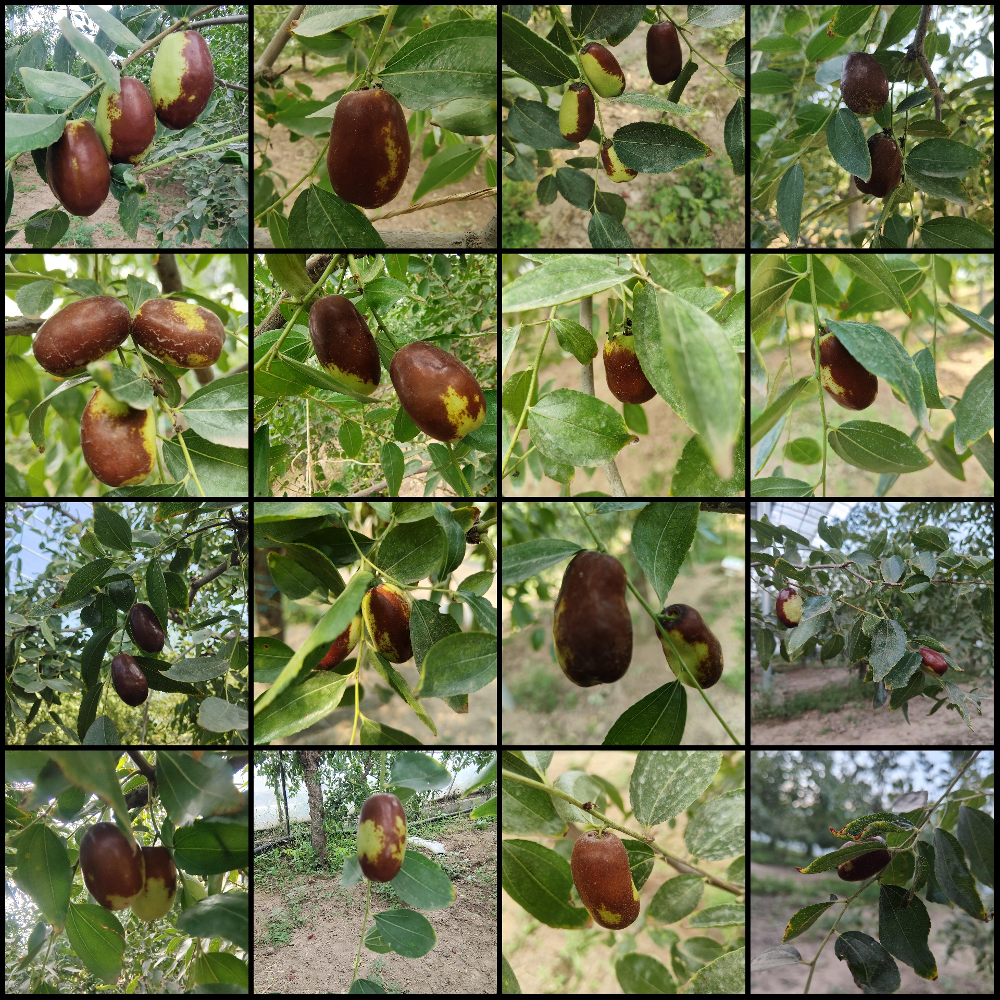
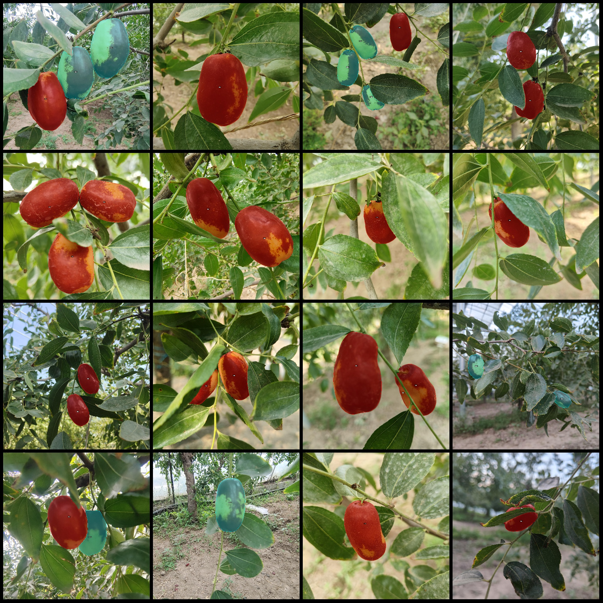
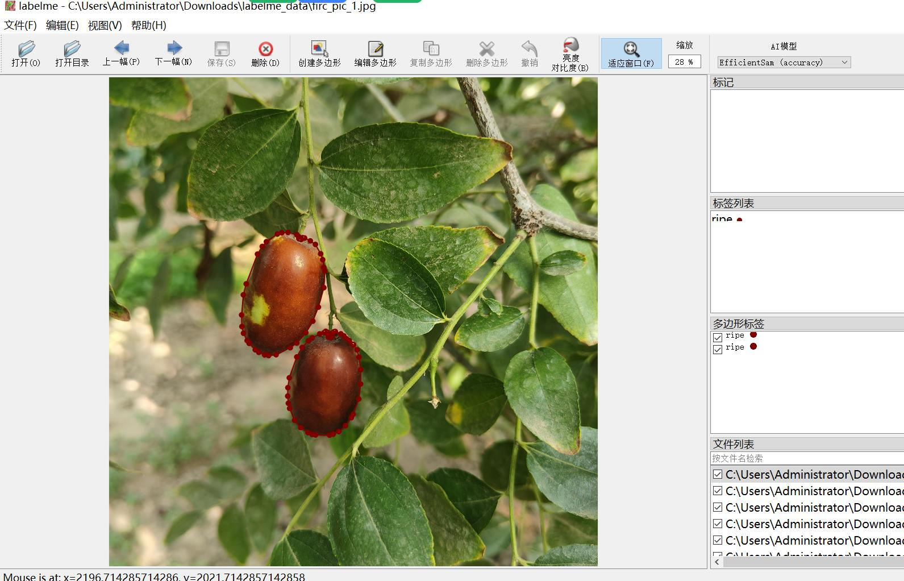

# Tree Fruit Ripening Detection Dataset in labelme Format with 234 Images and 3 Categories

The dataset is formatted as a labelme file (excluding the mask file, containing only JPG images and corresponding JSON files). The number of images (JPG file counts) is 234. There are 234 labeled 
files (JSON file counts). The number of categories is 3. The category names are ["ripe", "ripe", "unripe"]. Each category has been labeled with boxes:
- Ripe count = 172
- Ripe count = 365
- Unripe count = 83
Total box count = 620

Labeling Tool used: labelme v5.5.0
Image resolution: 3072x3072
Labeling rules: Polygons are drawn around the categories.
Important Note: You can open and edit the dataset using labelme. The JSON dataset needs to be converted into either mask or yolo or coco format for semantic segmentation or instance segmentation.
Special Notice: This dataset does not guarantee the accuracy of the trained model or weight files.
Image Preview:
Labeling Example:
Original Image (select 16 images at random):
Labeling drawing result:
Labelme editing image example:

## Images

Here is a pay link on Stripe ( https://buy.stripe.com/3cs8yP7sY87d0vu9AB ). Please contact me lonlonago@foxmail.com after funding $89, and I will send you a complete data files , thank you!

